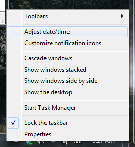

If you have an issue with your system clock losing time, you've probably had to go and re-sync your clock with the internet time servers. The problem is that there are just way too many clicks required to get to the right screen, so the command line is much simpler.

Note that you can partially solve this issue by changing the time server you are using or increasing the intervals between time checks, but there are some instances where youâll just want to quickly sync the time manually.

## Sync Clock the Slow GUI Way

First you'll have to right-click on the clock and choose "Adjust Date/Time"

Then you select the Internet Time tab, and click the Change Settings button.

After the UAC prompt you can finally click the **Update now** button to tell the computer to resync.

That.s a lot of steps. but check out how simple it is from the command line.

## Sync Clock from Command Line

Simply open an administrative mode command prompt (right-click, Run as administrator), and then type in the following command:

## w32tm /resync

And now your clock is sync.d. If you want proof, you could check the time settings panel again.

## References

*   <http://technet.microsoft.com/en-us/library/cc773263(WS.10).aspx>
*   <http://support.microsoft.com/kb/223184>
